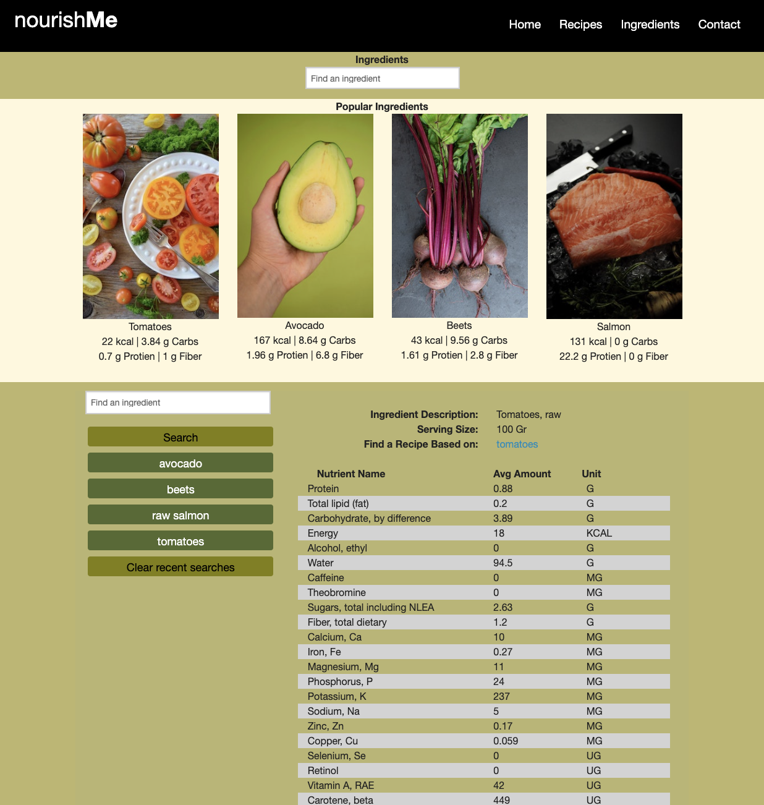

# Nourish Me

#### This is a site made by HTML, CSS, JavaScript, Bootstrap, Moment, and jQuery 

## Description

This website uses two Web API's that fetch recipes after you search for a dish or food item and also provides the nutritional value of each food item in the recipe once it is clicked. 

It also saves your search history which can be found in your console log. It displays the recently searched recipes on the left side of the screen to be easily accessed while on the site.

## Live site 

## Known Bugs
None known

## Technologies Used
* HTML
* CSS
* JavaScript
* Moment
* jQuery

## Contributors and Github profiles
* Wendy Nguyen https://github.com/wendyqnguyen 
* Dimitrius M. Brown https://github.com/TheMagnificentDOMB
* Ellyse Carter https://github.com/ellysecarter 
* Sean Hool https://github.com/HoolSeanalan 
* Josue Santos-Aguilera https://github.com/ok-josue/ 

