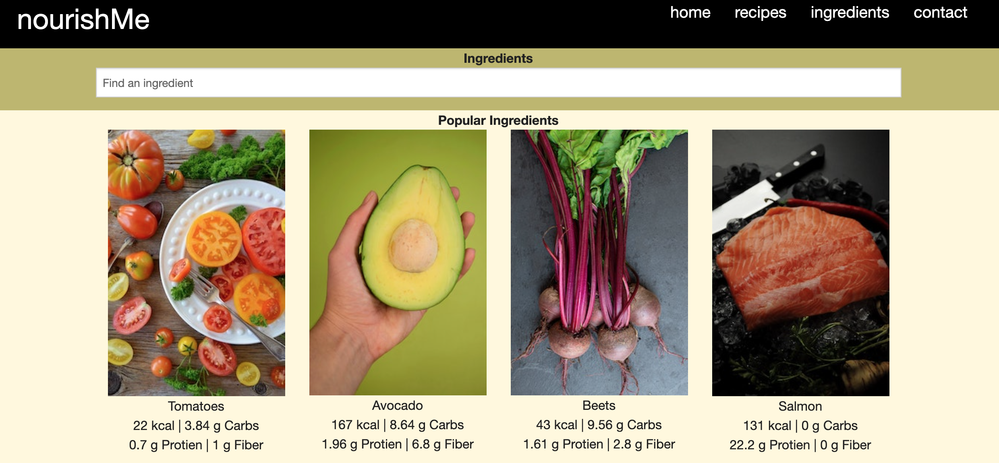

# nourishMe 

## Let's get healthy!

### A site that not only gives you the recipe, but provides the nutritional breakdown of each ingredient.

## Deployed application:
https://ellysecarter.github.io/nourish-me/ 

## Table of Contents
* [Technologies used](#technologies-used)
* [Features](#features)
* [Known bugs](#known-bugs)
* [Images](#stock-images-provided-by)
* [Contributors](#contributors)

## Technologies Used
* HTML
* CSS
* JavaScript
* Foundation
* jQuery
* [Spoonacular API](https://spoonacular.com/food-api)
* [FCD API](https://fdc.nal.usda.gov/api-guide.html) 

## Features
* Search by dish or single ingredient on recipes page
* A list of ingredients will populate as well as a link to a full recipe 
* Each ingredient on the recipe's page can be clicked which will bring you to the ingredients page
* Ingredients page will provide description, serving size, and full nutritional breakdown of the ingredient
* Recent searches will be saved on both recipe and ingredient page
* You can clear your recent searches

## Known Bugs
* Spoonacular has a daily quota of 150 API calls. If you search for a recipe and it does not populate a result, it is because we have hit our daily limit of 150 requests. 

## Stock images provided by:
* [sunorwind](https://unsplash.com/@sunorwind)
* [Emma-Jane Hobden](https://unsplash.com/@emmalejane)
* [Nadine Primeau](https://unsplash.com/@nadineprimeau)
* [Disiana Caballero](https://unsplash.com/@disi_03) 
* [S O C I A L . C U T](https://unsplash.com/@socialcut)
* [Kristine Tumanyan](https://unsplash.com/@krstne)

## Contributors
* Wendy Nguyen [@wendyqnguyen](https://github.com/wendyqnguyen) 
* Dimitrius M. Brown [@TheMagnificentDOMB](https://github.com/TheMagnificentDOMB)
* Ellyse Carter [@ellysecarter](https://github.com/ellysecarter)
* Sean Hool [@HoolSeanalan](https://github.com/HoolSeanalan) 
* Josue Santos-Aguilera [@ok-josue](https://github.com/ok-josue) 
